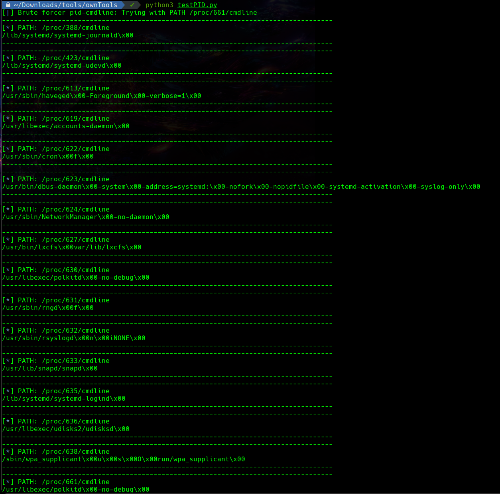

# PID Brute forcer

Es una utilidad que permite encontrar el comando ejecutado al momento de correr el proceso en cuestión. Originalmente fue creado para la máquina "Retired" de "Hack The Box". Cualquiera es libre de copiarlo y modificarlo a su gusto.

---

It is a utility that allows you to find the command executed at the time of running the process in question. It was originally created for the "Retired" machine of "Hack The Box". Feel free to copy and modify it as you need.

## Ejemplo/Example

